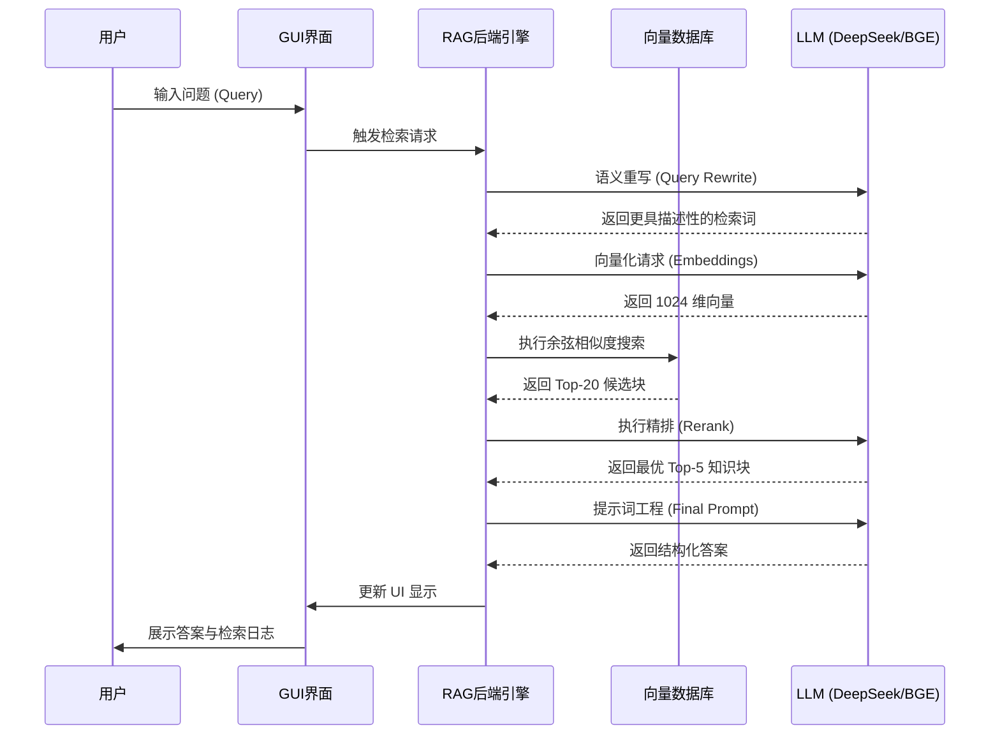
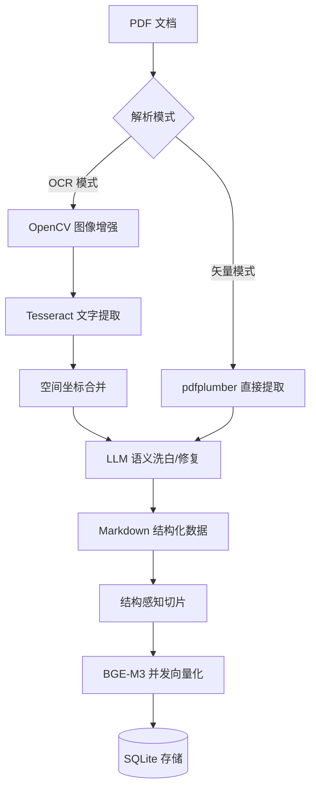
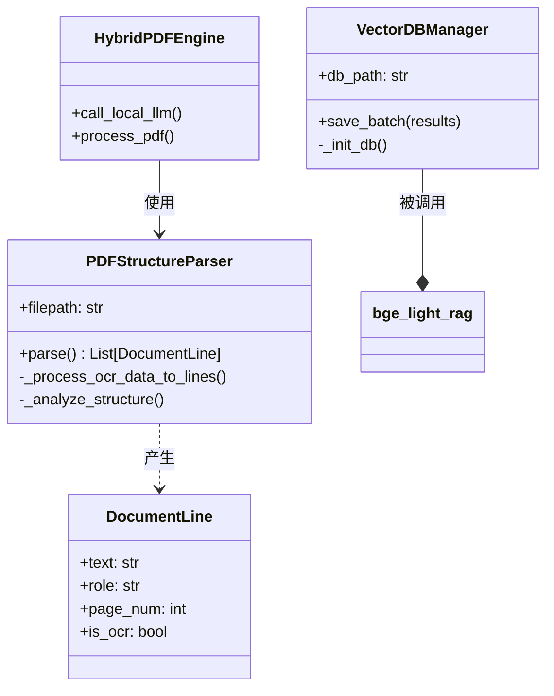
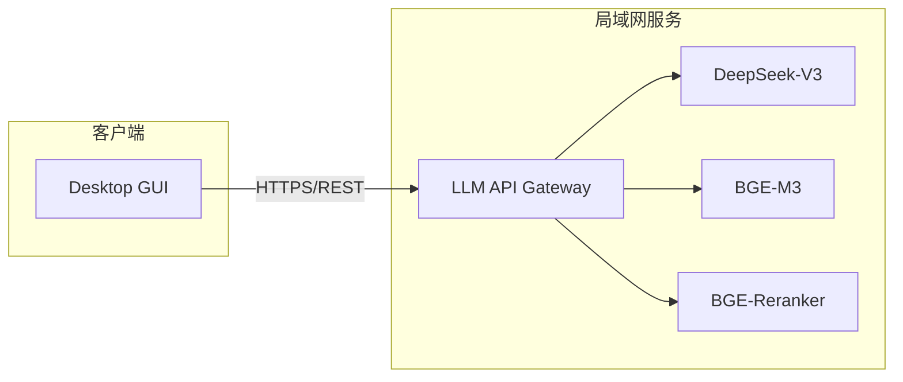

# 系统架构与流程图 (System Diagrams)

## 1. 核心业务流程 (Sequence Diagram)

```mermaid
sequenceDiagram
    participant U as 用户
    participant G as GUI界面
    participant B as RAG后端引擎
    participant V as 向量数据库
    participant L as LLM (DeepSeek/BGE)

    U->>G: 输入问题 (Query)
    G->>B: 触发检索请求
    B->>L: 语义重写 (Query Rewrite)
    L-->>B: 返回更具描述性的检索词
    B->>L: 向量化请求 (Embeddings)
    L-->>B: 返回 1024 维向量
    B->>V: 执行余弦相似度搜索
    V-->>B: 返回 Top-20 候选块
    B->>L: 执行精排 (Rerank)
    L-->>B: 返回最优 Top-5 知识块
    B->>L: 提示词工程 (Final Prompt)
    L-->>B: 返回结构化答案
    B->>G: 更新 UI 显示
    G->>U: 展示答案与检索日志
```

## 2. 知识入库流水线 (Flowchart)

```mermaid
graph TD
    A[PDF 文档] --> B{解析模式}
    B -->|OCR 模式| C[OpenCV 图像增强]
    C --> D[Tesseract 文字提取]
    D --> E[空间坐标合并]
    B -->|矢量模式| F[pdfplumber 直接提取]
    E --> G[LLM 语义洗白/修复]
    F --> G
    G --> H[Markdown 结构化数据]
    H --> I[结构感知切片]
    I --> J[BGE-M3 并发向量化]
    J --> K[(SQLite 存储)]
```

## 3. 核心类关系 (Class Diagram - 简化版)

```mermaid
classDiagram
    class DocumentLine {
        +text: str
        +role: str
        +page_num: int
        +is_ocr: bool
    }

    class PDFStructureParser {
        +filepath: str
        +parse() List[DocumentLine]
        -_process_ocr_data_to_lines()
        -_analyze_structure()
    }

    class HybridPDFEngine {
        +call_local_llm()
        +process_pdf()
    }

    class VectorDBManager {
        +db_path: str
        +save_batch(results)
        -_init_db()
    }

    PDFStructureParser ..> DocumentLine : 产生
    HybridPDFEngine --> PDFStructureParser : 使用
    VectorDBManager --* bge_light_rag : 被调用
```

## 4. 系统部署拓扑 (Deployment)

```mermaid
graph LR
    subgraph 客户端
    UI[Desktop GUI]
    end

    subgraph 局域网服务
    API[LLM API Gateway]
    M1[DeepSeek-V3]
    M2[BGE-M3]
    M3[BGE-Reranker]
    end

    UI -->|HTTPS/REST| API
    API --> M1
    API --> M2
    API --> M3
```
